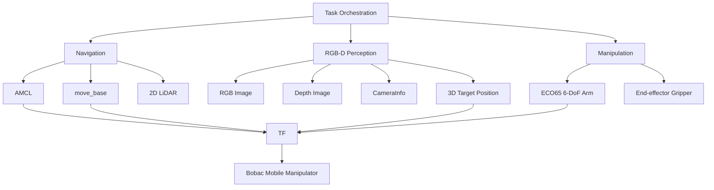
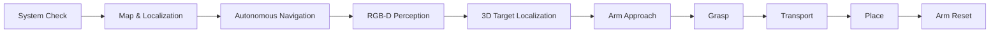
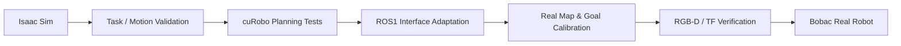

# 🤖 ROS Autonomous Mobile Manipulator

> 基于 ROS Noetic、RGB-D 视觉与六自由度机械臂的自主移动操作机器人系统，实现从定位导航、目标感知与三维定位，到抓取、转运和放置的完整任务闭环。

[](https://www.ros.org/)
[](https://ubuntu.com/)
[](https://www.python.org/)
[](https://opencv.org/)

## 🎬 Demo

▶ **Bilibili:** https://www.bilibili.com/video/BV1Jgbw6LE9Y/

---

## 📖 Overview

机器人需要自主移动到指定工作区域，利用 RGB-D 相机完成目标检测与三维位置估计，再控制机械臂完成抓取、转运和放置。

系统部署在 **TuringStack Bobac** 单臂轮式机器人平台上，以 **ROS Noetic** 为主要运行环境，并结合 **Isaac Sim / ROS 2 / cuRobo** 进行仿真侧的流程与运动规划验证。

- **Localization & Navigation**：地图加载、AMCL 定位、`move_base` 路径规划与动态避障
- **RGB-D Perception**：彩色图像、深度图与相机内参同步获取
- **3D Localization**：由目标像素位置与深度信息恢复相机坐标系下三维位置
- **Manipulation**：ECO65 机械臂抓取、转运、放置与安全复位
- **System Integration**：底盘、雷达、相机、机械臂、TF 与 ROS 通信链路集成
- **Deployment Tooling**：环境检查、参数配置、启动脚本、日志与现场恢复流程

---

## ✨ Key Features

| 模块 | 实现内容 |
| --- | --- |
| 自主定位 | 基于已知地图与 AMCL 完成机器人位姿估计 |
| 自主导航 | `move_base` 目标点导航、全局/局部规划与动态避障 |
| RGB-D 感知 | 获取 RGB、Depth 与 `CameraInfo`，完成目标区域检测 |
| 三维定位 | 根据像素坐标、深度值和相机内参计算目标三维位置 |
| 机械臂操作 | 识别姿态、抓取、搬运、放置和复位 |
| 真机适配 | Bobac 底盘、Berxel 相机、ECO65 机械臂及 ROS 驱动链路联调 |
| 仿真验证 | Isaac Sim / ROS 2 / cuRobo 辅助验证运动与抓取流程 |
| 工程化支持 | 环境变量、恢复脚本、启动检查、参数配置与运行日志 |

---

## 🧠 System Architecture



系统以 ROS 话题、服务、TF 坐标变换和设备驱动为基础，将移动导航、视觉感知与机械操作连接成一套完整执行链路。

---

## 🔄 End-to-End Workflow



执行过程：

1. 检查 ROS Master、TF、传感器和机械臂通信状态。
2. 加载地图并完成 AMCL 初始定位。
3. 通过 `move_base` 导航至目标工作区域。
4. RGB-D 相机获取彩色图像、深度图和相机参数。
5. 检测目标并计算相机坐标系下的三维位置。
6. 机械臂进入操作姿态并执行抓取。
7. 移动底盘完成物料转运。
8. 机械臂在目标区域完成放置并安全复位。

---

## 🚗 Localization & Navigation

导航链路基于 ROS Navigation Stack：

```text
Saved Map
   ↓
AMCL Localization
   ↓
move_base
   ↓
Global / Local Planning
   ↓
Obstacle Avoidance
   ↓
Goal Pose
```

导航部分主要完成：

- 现场地图加载与地图坐标系维护
- AMCL 粒子滤波定位
- 目标点发送与导航状态监控
- 全局路径规划与局部避障
- 到达目标区域后的位姿检查
- 地图、雷达与 TF 状态的可视化验证

### Example Navigation Record

| 项目 | 记录值 |
| --- | ---: |
| 目标点 | `x = 2.798 m, y = -1.645 m` |
| 实际到达 | `x = 2.776 m, y = -1.640 m` |
| 平面位置误差 | 约 `2.3 cm` |
| 朝向误差 | 约 `0.9°` |
| 单次导航耗时 | 约 `35 s` |

> 上述数据为特定地图、参数和现场条件下的一次工程记录，用于复现实验环境，不作为系统统计性能基准。

---

## 👁️ RGB-D Perception & 3D Localization

视觉部分使用 **Berxel iHawk100 RGB-D 相机**，同时读取：

- RGB 图像
- Depth 深度图
- `CameraInfo` 相机内参

处理流程：

```text
RGB Image
   ↓
ROI Filtering
   ↓
Color / Contour / Geometry Filtering
   ↓
Target Pixel Center (u, v)
   ↓
Depth Sampling
   ↓
Camera Intrinsics
   ↓
3D Position (X, Y, Z)
```

当前任务中的目标采用颜色、轮廓、长宽比等几何特征进行筛选。识别后输出目标检测区域、中心像素、深度距离以及相机坐标系下的三维位置，为后续机械臂抓取提供输入。

三维定位遵循典型针孔相机反投影关系：

```text
Z = depth(u, v)
X = (u - cx) * Z / fx
Y = (v - cy) * Z / fy
```

其中 `fx / fy / cx / cy` 来自相机 `CameraInfo`。

---

## 🦾 Manipulation

机械操作部分使用 **ECO65 六自由度机械臂**与末端夹爪，通过 ROS 驱动接口完成姿态控制与抓取流程。

```text
Navigation Finished
       ↓
Arm to Observation Pose
       ↓
Acquire RGB-D Target Position
       ↓
Generate Grasp Target
       ↓
Arm Approach
       ↓
Close Gripper
       ↓
Lift / Transport
       ↓
Place Object
       ↓
Return to Safe Pose
```
---

## 🧪 Simulation & Real-Robot Deployment

项目同时保留仿真与真机两条开发链路：



### Simulation

仿真侧主要用于：

- 机器人模型与 TF 关系检查
- 机械臂运动与抓取流程验证
- 运动规划接口实验
- 任务执行逻辑的快速迭代

### Real Robot

真机侧主要完成：

- ROS Noetic 系统集成
- 现场地图构建与定位参数调试
- 导航目标点重新标定
- RGB-D 相机话题与深度数据验证
- ECO65 机械臂、夹爪与底盘协同
- 多设备通信与启动顺序检查
---

## 🧰 Hardware

| Hardware | Role |
| --- | --- |
| TuringStack Bobac / Bobac3 | 全向移动机器人底盘 |
| ECO65 | 六自由度机械臂 |
| End-effector Gripper | 目标抓取与释放 |
| 2D LiDAR | 定位、导航与避障 |
| Berxel iHawk100 RGB-D Camera | RGB-D 感知与目标三维定位 |

---

## 🛠 Software Stack

**Robot Runtime**

`Ubuntu 20.04` · `ROS Noetic` · `TF` · `RViz`

**Navigation**

`AMCL` · `move_base` · `map_server` · `Cartographer`

**Perception**

`Berxel RGB-D` · `OpenCV` · `Depth Image` · `CameraInfo`

**Manipulation**

`ECO65` · `rm_driver` · `ROS Control`

**Simulation**

`NVIDIA Isaac Sim` · `ROS 2` · `cuRobo`

**Development**

`Python` · `Bash` · `YAML` · `ROS launch`

---

## 📁 Repository Structure

```text
ros-autonomous-mobile-manipulator/
│
├── scripts/
│   ├── navigation / perception / manipulation scripts
│   ├── robot environment restore & startup scripts
│   ├── legacy_20260827/
│   │   └── earlier real-robot iterations
│   └── sim_tools/
│       └── Isaac Sim / ROS 2 utilities
│
├── configs/
│   ├── robot runtime parameters
│   ├── arm / grasp parameters
│   └── RViz configuration
│
├── maps/
│   └── site_0827_new.*
│       └── real-environment navigation map
│
├── docs/
│   ├── deployment notes
│   ├── development & validation records
│   └── operation procedures
│
├── third_party/
│   └── official_demo/
│       └── platform / vendor reference examples
│
├── NOTICE
├── .gitignore
└── README.md
```
---

## 🚀 Quick Start

> 本项目依赖 Bobac 平台 ROS 软件包、Berxel 相机驱动和 ECO65 机械臂驱动。仓库并未重新分发全部厂商依赖，运行前请先完成对应设备环境安装。

### 1. Configure Local Environment

```bash
cp scripts/env.example.sh scripts/env.local.sh
vi scripts/env.local.sh
source scripts/env.local.sh
```
### 2. Restore / Synchronize Project Files

```bash
bash scripts/00_restore_to_robot.sh
```

### 3. Start Navigation & RViz

```bash
bash scripts/01_start_nav_terminal1.sh
```

### 4. Navigate to Perception Area

```bash
bash scripts/02_go_detect_then_recognition_terminal2.sh
```

运行时可根据脚本输出确认：

```text
NAV_OK=True
CAMERA_TOPICS_OK=True
PEN_DETECT_OK=True
```
检查目标的深度值和相机坐标系三维位置。

---

## 🔧 Engineering Notes

保留了大量面向部署的工程逻辑，包括：

- ROS 节点和设备启动顺序
- 真机环境变量与路径管理
- 导航目标点现场重标定
- 相机话题与深度有效性检查
- TF 链路验证
- 机械臂安全姿态与动作参数
- 运行前 preflight check
- 任务失败后的环境恢复
- 日志保存和问题定位

这些内容用于提高不同调试阶段之间的可复现性，并减少多设备系统中由环境差异造成的问题。

---

机器人底盘、相机和机械臂相关官方 ROS 驱动，以及 ROS 社区组件、cuRobo 等第三方项目不属于本仓库原创内容。`third_party/official_demo/` 中仅保留必要的参考示例。

详细来源和版权归属请参阅 [`NOTICE`](./NOTICE)。
---

## 📚 Project Background

该系统最初围绕受限时间内的真实移动操作任务进行开发，因此在仓库中保留了较完整的快速部署、环境恢复、现场标定和故障检查工具。后续整理时将其作为一个独立的 **ROS Autonomous Mobile Manipulation** 工程保留，用于移动机器人导航、RGB-D 三维感知和机械臂协同控制的学习、复现与继续开发。

